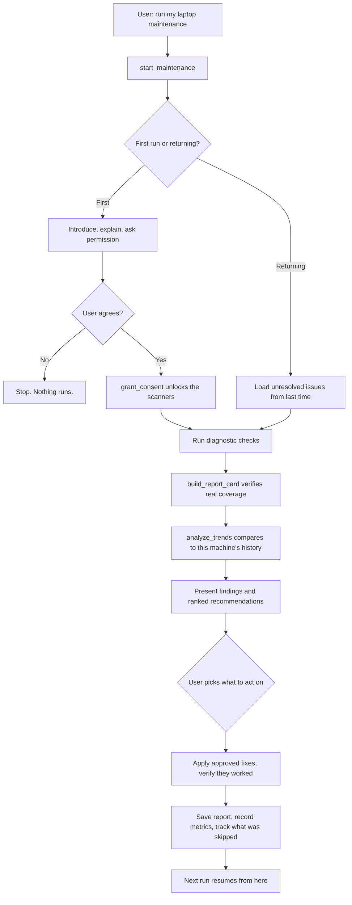

# laptop-care

A laptop maintenance agent that runs inside Claude Desktop. It inspects your machine, explains what it found, recommends what to do, and remembers what it saw last time.

Works on macOS and Windows. No API key, it runs on your existing Claude Desktop subscription. Nothing leaves your machine.

```bash
npx laptop-care setup
```

Then restart Claude Desktop and say **"run my laptop maintenance"**.

---

## What you actually get

A 15 point inspection, presented the way a garage hands you a check sheet after a service. Every point is shown, not just the failures, because knowing 10 things passed is as useful as knowing 2 failed.

```
LAPTOP INSPECTION REPORT
MacBook Pro 16-inch 2021  ·  M1 Pro  ·  32 GB  ·  macOS 26.5.1
First inspection  ·  15 points checked

STORAGE
  Disk space             Good      607 GB free of 926 GB, 65 percent
  Cache composition      Watch     Docker 6 GB of it, rebuilds in weeks

SECURITY
  Disk encryption        Good      FileVault on
  Startup agents         Watch     49 agents and daemons present

MAINTENANCE
  OS updates             Action    26.5.2 available, security release
  Backup                 Ask       No Time Machine, need your answer

  10 good  ·  4 watch  ·  1 needs action  ·  1 question for you
```

Then a verdict in plain language, a ranked list of what to do, and it acts only on what you approve.

---

## Why this is an agent and not a script

A script runs the same 15 commands in the same order and prints the output. This decides what to do based on what it finds and what it remembers.

| | A maintenance script | laptop-care |
|---|---|---|
| **Sequence** | Fixed, every run identical | Chooses the workflow from detected state |
| **Interpretation** | Prints values | Explains what a value means for this machine |
| **Thresholds** | Hardcoded globals | Learns each machine's own normal, flags deviation from that |
| **Memory** | None, or a log nobody reads | Reads its own history and compares |
| **Consent** | Runs whatever it was told to | Asks before anything destructive, and is blocked in code if it does not |
| **Follow-through** | Forgets | Tracks what you skipped and raises it next time |
| **Failure** | Crashes or prints an error | Reports the check as not completed and continues |

The agent loop in practice:



---

## Guardrails that are code, not instructions

The interesting part is what the agent is *unable* to do. These are enforced by the server, so they hold even if the model misreads its instructions.

**Consent lock.** On a fresh install every scanning tool is locked. The model cannot read your disk, battery, or security posture until it has introduced itself and you have said yes.

```
delete BEFORE consent      ->  CONSENT_REQUIRED
```

**Sequencing gates.** Destructive tools refuse to run until their prerequisite has completed. "Never clean without showing the user first" is a precondition, not a request.

```
save_report BEFORE diagnostic  ->  PREREQUISITE_NOT_MET
save_report AFTER  diagnostic  ->  saved
```

**Honest coverage.** The inspection card is generated by the server from a log of what genuinely executed. Run 3 checks of 15 and the card says so. The model cannot claim an inspection it did not perform.

```
Ran 3 of 15 checks deliberately:
  total_points     : 15
  checks_completed : 3
  checks_missing   : 12
  rows locked to "Not checked": 12
```

The division of labor: **the server owns facts, sequencing, and coverage. The model owns judgment and language.** Anything that can be enforced is enforced; only what genuinely requires interpretation is left to the prompt.

---

## What it checks

| Category | Points |
|---|---|
| Storage | Disk space, largest folders, cache and temp size, cache composition by owner |
| Power | Battery health and cycles, sleep and wake behavior, uptime |
| Hardware | SSD SMART status, firmware version |
| Security | Firewall and Gatekeeper, disk encryption, startup agents, persistence changes since last run |
| Maintenance | Pending OS updates, backup status |

**Persistence monitoring** is the one most tools skip. Launch agents and daemons are how unwanted software survives a reboot. laptop-care records them on the first run and afterwards reports only what is **new**, which is the part worth reading.

---

## What it remembers

Everything stays in `~/.laptop-care/`, in your home folder, separate from the installed package. Updating or reinstalling never touches it.

| File | Holds |
|---|---|
| `health.csv` | One row per run. The basis for "normal for this machine" |
| `reports/` | Full markdown report per run |
| `issues.json` | Findings and their status: open, fixed, skipped, needs you |
| `persistence.json` | Startup agent snapshot for change detection |

Baselines need history to be useful. Trends become meaningful around the fourth run, and persistence changes start reporting from the second.

---

## Architecture

```
src/
  index.ts      MCP server: consent lock, sequencing gates, execution log,
                report card generation, lifecycle-aware playbook loading
  tools.ts      Tool definitions with safety tiers
  commands.ts   Platform commands keyed by darwin | win32
  runner.ts     exec wrapper with per-tool timeouts
  cli.ts        setup, help, and serve

prompts/
  kernel.md         Always sent on connect. Identity and safety rules.
  first-run.md      Onboarding workflow. Only for new users.
  returning-run.md  Follow-up workflow. Only for returning users.
  shared.md         Judgment, escalation thresholds, tone, report format.
```

The playbook is split by **when it is needed**, not by topic. A returning user never loads first-time onboarding. `start_maintenance` checks whether history exists and hands over only the workflow that applies:

| Situation | Loaded |
|---|---|
| Connect, laptop never mentioned | 438 tokens |
| First run | 4,694 tokens |
| Returning run | 2,811 tokens |

32 tools across three safety tiers: 25 read-only, 6 requiring explicit consent, 1 requiring admin.

---

## Scheduling

On the first run it offers to set up recurring checks, weekly, monthly, or quarterly. It creates a `launchd` agent on macOS or a Task Scheduler entry on Windows. You can also just say "schedule my maintenance checks" any time.

Without a schedule it still notices when it has been more than 30 days and mentions it.

---

## Manual setup

If `npx laptop-care setup` cannot find your config, add this to `claude_desktop_config.json`:

```json
{
  "mcpServers": {
    "laptop-care": {
      "command": "npx",
      "args": ["-y", "laptop-care"]
    }
  }
}
```

- macOS: `~/Library/Application Support/Claude/claude_desktop_config.json`
- Windows: `%APPDATA%\Claude\claude_desktop_config.json`

For Claude Code: `claude mcp add laptop-care -- npx -y laptop-care`

---

## Honest limitations

- **It reads surfaces.** It does not detect malware, verify that a backup restores, or confirm firmware is current against the vendor. It reports what the OS reports.
- **History only grows when a run finishes.** A run you interrupt records nothing. There is no partial save.
- **Baselines need about four runs** before "abnormal for this machine" means anything.
- **Tone and judgment are prompt-shaped.** The safety gates are code and hold absolutely. How well it explains a finding does not.
- **macOS and Windows only.** Linux returns a clear unsupported error rather than guessing.

---

## Requirements

Node.js 18+, Claude Desktop or another MCP client, macOS or Windows.

## License

MIT
